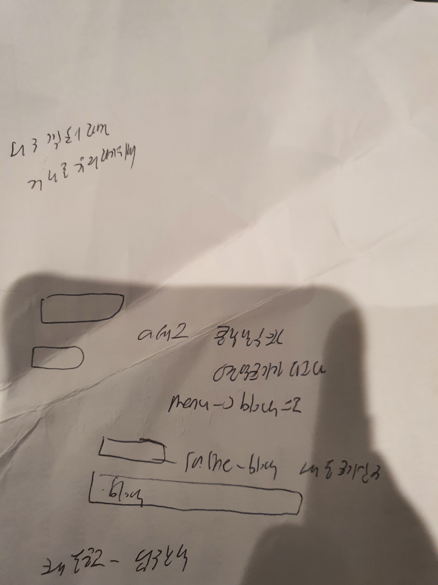

### 1.


### 2.
margin px붙어야 margin 20 auto (x)

### 3.
box-sizing: 기준크기가 정해져있을때만 유효 그렇지 않으면 padding적용하면 원래크기보다 커진다

### 4.
input,button : inline-block속성
box-sizing없어도 안으로 padding적용

### 5.
gap->부모요소에 줘야

### 6.
flex:1->자식요소에 줘야

### 7.
position:absolute의 상위에 기준이 될 position:relative가 없으면 body태그를 기준으로 한다

### 8.
부모영역의 크기는 자식요소의 크기가 커지면 커진다

### 9.
선택자는 최대 3단계 까지만
con1>div>div>ul 이런식으론 가급적 하지 않는다

### 10. 선택자 우선순위

```

.con1>div>div {
    display: block;
    flex: 1;
    border-top: 1px solid black;
    text-align: center;
}

.con1>.studio {
    border-top: none;
    font-size: 25px;
}

```

에서.studio는 .con1>div>div의 형제이나 2단계라 3단계인 윗 코드에 우선순위가 밀려 적용되지 않는다
수정하면

```

.con1>div>div {
    display: block;
    flex: 1;
    border-top: 1px solid black;
    text-align: center;
}

.con1>div>.studio {
    border-top: none;
    font-size: 25px;
}

```
