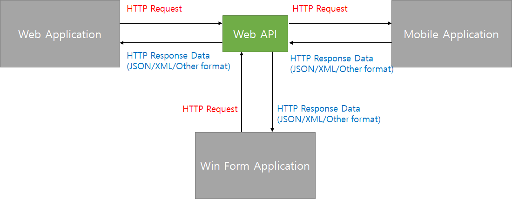
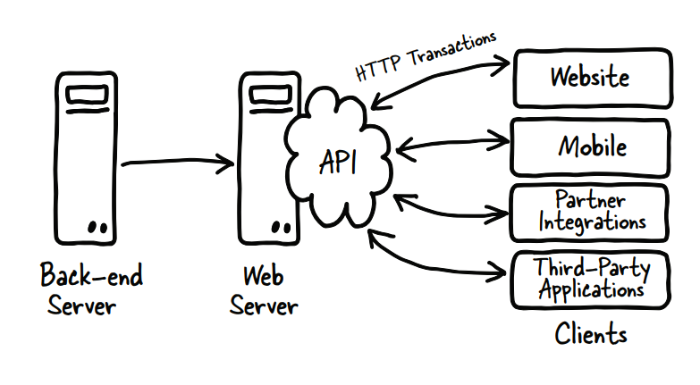

### 1.
1. API란?
  API는 Application Programming Interface의 약자로 응용 프로그램에서 사용할수 있도록, 운영체제나 프로그래밍 언어가 제공하는 기능을 제어할 수 있게 만드는 인터페이스를 뜻한다.

  주로 파일 제어, 창 제어, 화상 처리, 문자 제어 등 자신이 원하는 기능을 제어할 수 있도록 하는 인터페이스를 제공한다. 따라서 원하는 기능을 제어하는 API를 직접 만들 수도 있다.

 

 

2. WEB API란?
  웹 서버 또는 웹 브라우저를 위한 애플리케이션 프로그래밍 인터페이스이다. HTTP 서비스이고 다양한 클라이언트에서 접근이 가능하도록 설계되어있다. Web 환경을 통해 제공되는 데이터 CRUD인터페이스를 제공한다.
  
  
  
    HTTP 표준 접근 방식을 이용하며 플랫폼 환경, 클라이언트 환경의 제한이 없는 서비스 구현이 가능하다.

 

 

3. REST란?
  REST는 Representational State Transfer의 약자이다. 자원을 URI로 표시하고 해당 자원의 상태를 주고 받는 것을 의미한다.

 

REST의 구성요소

- 자원(Resource): URI

- 행위(Verb): HTTP METHOD

- 표현(Representations)

 

  따라서, REST는 URI를 통해 자원을 표시하고 HTTP METHOD를 이용하여 해당 자원의 행위를 정해주며 그 결과를 받는 것을 말한다.

*RESTful이란?

  REST를 REST답게 쓰기 위한 방법으로 공식적이지 않은 개발자들이 비공식적으로 제시한 것이다. 이해하기 쉽고 사용하기 쉬운 REST API를 만드는 것이 목적이다.

 

- CRUD의 기능을 전부 활용해야한다. (예. POST로만 모든 것을 처리하면 RESTFUL이 아니다.)

- URI에 자원과 id외 정보만 들어가야한다.

4. URL vs URI
[URL]

- 프로토콜: http, https, ftp 등

- 호스트네임: 도메인 or IP (서버컴퓨터의 이름 - 위치)

- URL path: 서버컴퓨터(host)에서 클라이언트가 요청한 파일 디렉토리

- 쿼리: 추가적 질문사항

 

[URI]

- Identifier: 식별자, 자원 식별자, id값(index)

- URI가 URL을 포함

- 예시: http://localhost/article/7 -> article(예를 들어 db 테이블 이름)이라는 db에 저장된 데이터 7번째 것을 나타냄

 

즉, URL은 서버컴퓨터에서 클라이언트가 요청한 파일의 디렉토리를 나타내지만 URI는 자원의 고유 식별자(id값)이다.

5. 기존 방식과 RESTful API
CREATE	POST, /Write.aspx?name=contact	POST, /Contact
READ	GET, /List.aspx?name=contact&id=1	GET, /Contact/1
UPDATE	PUT, /Edit.aspx?name=contact&id=1	PUT, /Contact/1
DELETE	DELETE, /Delete.aspx?name=contact&id=1	DELETE, /Contact/1

6. HTTP 응답 코드
2xx 성공

 

200: 클라이언트의 요청을 정상적으로 수행함.

201: 클라이언트에게 생성 작업을 요청 받았고, 생성 작업을 성공함.

204: 요청은 성공 했지만 응답할 콘텐츠가 없음.

 

 

3xx 리다이렉션

 

301: 클라이언트가 요청한 리소스에 대한 URI가 영구적으로 변경되었을 때 사용함.

302: 301과 같으나 임시적으로 주소가 바뀌었을 경우 사용함.

304: 이전에 방문했을 때의 요청 결과와 다르지 않을 경우 사용함. 캐시된 페이지를 그대로 사용.

307: 임시 페이지로 리다이렉트.

 

 

4xx 클라이언트 오류

 

400: 클라이언트가 올바르지 못한 요청을 보냄.

401: 로그인을 하지 않아 페이지를 열 권한이 없음.

403: 금지된 페이지, 로그인을 하든 안하든 접근할 수 없음. (관리자 페이지)

404: 찾을 수 없는 페이지, 주소를 잘 못 입력했을 때 사용함.
403 대신에 사용할 수도 있음.(해커들의 공격을 방지하고자 페이지가 없는 것처럼 위장함)

408: 요청 시간이 초과됨.

409: 서버가 요청을 처리하는 과정에서 충돌이 발생한 경우. (회원가입 중 중복된 아이디인 경우)

410: 영구적으로 사용할 수 없는 페이지.

 

 

5xx 서버 오류

 

501: 해당 요청을 처리하는 기능이 만들어지지 않음.

502: 서버로 가능 요청이 중간에서 유실된 경우.

503: 서버가 터졌거나 유지 보수 중
(유지 보수 중일때는 유지 보수중이라는 것을 알려주는 페이지로 전송해주는 것이 좋음)

504: 서버 게이트웨이에 문제가 생겨 시간 초과가 된 경우.

505: HTTP 버전이 달라 요청이 처리할 수 없음.

### 2.

웹 API란?
API라는 용어는 컴퓨터 시스템 간의 인터페이스 또는 기존 시스템의 다른 프로그램 간의 인터페이스를 뜻했습니다.

시스템은 비슷했지만, 서버 또는 클라이언트를 특정하지 않았습니다.

예를 들어 메일 서버는 데이터베이스를 사용하여 정보를 제공하지만 시스템은 본질적으로 함께 설계되었으며 둘은 분리 되어있지 않습니다.

그러한 API는 최근에 웹을 포함하도록 용어가 확장되었고, 웹 브라우저에서 모바일등의 클라이언트가 있는 시스템과 웹 서버를 설치하고 해당 서버의 데이터에 대해 작동하는 응용프로그램으로 분리 되었습니다.

 

웹 API의 개념을 이해하려면 프로토콜, 즉 시스템이 서로 대화하는 방식을 이해해야 합니다.

 

스위치보드 전화 시스템으로 예를 들어 보겠습니다.

오래전에, 전화기는 스위치보드에 연결하고 소음을 내는 기능만 있었습니다.

상대방한테 전화하고 싶으면 수화기를 들고 소음(벨소리)를 내 교환원이 대답하면 상대방에게 나의 전화번호로 상대방의 전화기에 소리를 내도록 만들었습니다. 그리고 나서 교환원은 당신과 상대방의 두 전화선을 연결했습니다.

이 경우에는 스위치보드(현재  "서버"로 동작) 및 특정 식별자를 전화 교환원이 당신의 전화로 연결한 것입니다.

 

이에 대한 프로토콜은 잘 되어 있어 전화 사용자들은 전화가 자동으로 가능하기 전까지 서로 교류할 수 있었습니다.

마찬가지로 HTTP는 브라우저가 생성하는 웹 트래픽을 구동하는 데 사용되는 잘 알려진 프로토콜입니다.

웹 API는 클라이언트가 정의된 인터페이스를 사용하여 HTTP 프로토콜을 통한 서버와 상호 작용하는 시스템입니다.

 

주소를 입력할 때 브라우저의 컨텍스트에서 이 기능이 작동하는 방식을 이해하려면 브라우저의 주소 표시줄에서 다음과 같은 고유한 리소스를 검색하도록 요청하는 경우 전화 번호에 도달합니다. 브라우저가 서버에 연결된 정보를 요청합니다.

그러면 브라우저에서 볼 수 있도록 반환되고 형식이 지정됩니다.

Web API 클라이언트는 시스템에 읽고 쓰기 위해 유사한 호출을 하지만, 응답은 브라우저 대신 처리할 프로그램에 맞게 포맷됩니다. 

프로토콜을 사용 할때 데이터를 위해 잘 설명된 메세지 형식을 갖는 것이 중요합니다.

왜냐하면 해당 프로토콜을 통해 전송되는 메시지이므로 형식이 정확해야 내용을 이해할수 있기 때문입니다.

컴퓨터 시스템의 요청를 위해 RESTful 웹 API는 생성, 읽기, 업데이트 및 삭제를 지원해야 합니다.

### 3.
XHR은 무엇일까?
XHR은 XMLHttpRequest의 약자로 말 그대로 http 프로토콜을 통해 서버에 자원을 요청하기 위해 사용한다.

페이지 전체를 새로고침 할 필요 없이 원하는 데이터를 url에서 제공받을 수 있다.

대표적인 예로 Ajax가 있다.

### 4.
HTTP 헤더
HTTP 헤더는 클라이언트와 서버가 요청 또는 응답으로 부가적인 정보를 전송할 수 있도록 해줍니다. HTTP 헤더는 대소문자를 구분하지 않는 이름과 콜론 ':' 다음에 오는 값(줄 바꿈 없이)으로 이루어져있습니다. 값 앞에 붙은 빈 문자열은 무시됩니다.

Content-Type
해당 개체에 포함되는 미디어 타입 정보
컨텐츠의 타입(MIME 미디어 타입) 및 문자 인코딩 방식(EUC-KR,UTF-8 등)을 지정한다.

타입 및 서브타입(type/subtype)으로 구성된다.

타입(type): 10개 정도 표준으로 지정됨(application, audio, font, image, multipart 등)

서브타입(subtype): 각 타입별로 수십에서 수백개 정도

Ex) Content-Type: text/html; charset-latin-1

해당 개체가 html 텍스트 문서이고, iso-latin-1 문자 인코딩 방식으로 표현되는 것을 의미한다.
(공통 헤더)

### 5.

Content-Type 헤더

Content-Type은 말그대로 HTTP 메시지(요청과 응답 모두)에 담겨 보내는 데이터의 형식을 알려주는 헤더입니다.

세상에 모든 브라우저와 모든 웹서버가 그렇다고는 말할 수 없겠지만 대부분의 HTTP 표준 스펙을 따르는 브라우저와 웹서버는 우선적으로 저 Content-Type 헤더를 기준으로 HTTP 메시지에 담긴 데이터를 분석하고 파싱할것입니다.
 
만약 Content-Type헤더가 없다면 데이터를 전송하는쪽(브라우저나 웹서버)에서는 특정한 형식의 데이터일지라도 받아들이는 쪽에서는 단순 텍스트 데이터라고밖에 생각할 수 없을것이며, 이를 분석하고 파싱하는 프로그램을 별도로 작성해주어야 겠지요.
 
그러나 여기서 알아야할 점은 HTTP 요청의 경우 GET방식인 경우에는 무조건 URL 끝에 쿼리스트링으로 key=value 형식으로 날아가기 때문에 굳이 Content-Type 헤더가 필요 없습니다. 

웹서버 입장에서도 요청메시지의 METHOD가 GET이면 key=value 형식의 데이터라는것을 유추할 수 있기 때문입니다.
 
따라서 Content-Type은 POST나 PUT처럼 메시지 BODY에 데이터를 싣어 보낼때 중요합니다. 

예를 들어 브라우저를 기준으로 설명하자면 AJAX를 통해 json 형식의 데이터를 전송하는 경우 Content-Type 값을 application/json 으로 지정하여 보낼 수 있고 <form>태그를 통해 첨부파일 등을 전송하는 경우라면 브라우저가 자동으로 Content-Type울 multipart/form-data로 설정하여 요청 메시지를 보낼것입니다.
 

 

 
Accept 헤더
Accept 헤더의 경우에는 브라우저(클라이언트) 에서 웹서버로 요청시 요청메시지에 담기는 헤더입니다.
  
  이 Accept헤더는 자신에게 이러한 데이터 타입만 허용하겠다는 뜻입니다.
  
  즉 브라우저가 요청 메시지의 Accept 헤더 값을 application/json이라고 설정했다면 웹서버에게 나는 json 데이터만 처리할 수 있으니 json 데이터 형식으로 응답을 돌려줘 라고 말하는것과 같습니다.
  
  물론 그것을 지키든 지키지 않든 하는것을 웹서버 마음이겠지만요.
 

 
정리
Content-Type 헤더와 Accept 헤더 둘 다 데이터 타입(MIME)을 다루는 헤더이지만 Content-Type 헤더는 현재 전송하는 데이터가 어떤 타입인지에 대한 설명이고 Accept 헤더는 클라이언트가 서버에게 웬만하면 데이터 전송할때 이러이러한 타입으로 가공해서 보내라 라고 하는것과 같습니다.
  
### 6.
  
  MIME이란? Multipurpose Internet Mail Extensions의 약자로 간략히 말씀을 드리면 파일 변환을 뜻한다고할 수 있습니다.

MIME는 이메일과 함께 동봉할 파일을 텍스트 문자로 전환해서 이메일 시스템을 통해 전달하기 위해 개발되었기 때문에 이름에 Internet Mail Extension 입니다
  
  그렇지만 현재는 웹을 통해서 여러형태의 파일 전달하는데 쓰이고 있습니다.

  MIME을 사용하기전에는 UUEncode 방식을 이용하고 있었으며 UUEncode에는 치명적인 단점이 있었습니다 그러한 단점을 보강하여 새로운 인코딩 방식이 등장하게 되었으니 이것을 MIME이라고 합니다.

예전에는 텍스트파일을 주고받는데 ASCII로 공통된 표준에 따르기만하면 문제가 없었습니다
  
  하지만 네트워크를 통해 ASCII 파일이 아닌 바이너리 파일을 보내는 경우가 생기게 되었습니다 이러한 바이너리파일에는 음악파일, 무비파일, 워드파일 등등의 문서를 지칭하는 것입니다.

하지만 ASCII만으로는 전송이 불가능하여 이러한 바이너리 파일들을 기존의 시스템에서 문제 없이 전달하기 위해서는 텍스트파일로 변환이 필요하게 되었습니다

이러한 텍스트파일로 변환을 인코딩(Encoding)이라고하며, 텍스트 파일을 바이너리 파일로 변환하는 과정을 디코딩(Decoding)이라고 합니다.
  
### 7.
  
  json server 는 아주 짧은 시간에 REST API 를 구축해주는 라이브러리입니다. 
  
  하지만, REST API 서버의 기본적인 기능을 대부분 갖추고 있는데요, 프로덕션 전용은 아닙니다.
  
  프로토타입을 만들거나, 지금처럼 공부를 위하여 서버가 필요할때에 사용하면 아주 적당한 도구입니다.
  
  json-server 에서는 단순히 데이터를 넣고 조회하는 것 외에도 페이징, 필터링, 정렬, 수정, 삭제 등의 기능을 지원합니다.
  
  json-server 는 내부적으로 lowdb 라는 단순한 데이터베이스를 이용하며 최소한의 REST API를 기본 지원한다. 
  
  운영서버로 사용하기에는 여러가지로 기능이 부족하지만 토이프로젝트용 백엔드나 프로토타이핑용 백엔드 서버로 사용하기에는 안성맞춤이다.
  
### 8. 클라이언트->브라우저
  
  웹서버의 이용자는 브라우저다 따라서 브라우저를 클라이언트라고 부른다
  
### 9. 런타임
  
  런타임(영어: runtime→실행시간)은 컴퓨터 과학에서 컴퓨터 프로그램이 실행되고 있는 동안의 동작을 말한다.
  
  "런타임"이라는 용어는 컴퓨터 언어 안에 쓰인 프로그램을 관리하기 위해, 특정한 컴파일러나 가상 머신이 사용하는 기본 코드의 라이브러리나 프로그램을 통틀어 런타임 라이브러리라고도 일컫는다.

런타임 환경(영어: runtime environment)은 컴퓨터가 실행되는 동안 프로세스나 프로그램을 위한 소프트웨어 서비스를 제공하는 가상 머신의 상태이다.
  
  운영 체제 자체에 속하는 경우도 있고 운영 체제에서 작동하는 소프트웨어를 뜻할 수도 있다.
  
  런타임(Runtime)과 컴파일타임(Compiletime)은 소프트웨어 프로그램개발의 서로 다른 두 계층의 차이를 설명하기 위한 용어이다.
  
  프로그램을 생성하기 위해 개발자는 첫째로 소스코드를 작성하고 컴파일이라는 과정을 통해 기계어코드로 변환 되어 실행 가능한 프로그램이 되며, 이러한 편집 과정을 컴파일타임(Compiletime) 이라고 부른다.

컴파일과정을 마친 프로그램은 사용자에 의해 실행되어 지며, 이러한 응용프로그램이 동작되어지는 때를 런타임(Runtime)이라고 부른다.

"런타임"과 "컴파일 타임"이라는 용어는 종종 서로다른 두 가지 타입의 에러를 나타내기 위해 사용되어지곤 하는데,
  
  컴파일 타임 에러는 프로그램이 성공적으로 컴파일링되는 것을 방해하는 신택스에러(Syntax error)나 파일참조 오류와 같은 문제를 말하며,
  
  이런 경우 컴파일러는 컴파일 타임 에러를 발생시키고 일반적으로 문제를 일으킨 소스코드 라인을 지시해준다.

만약, 어떤 소스코드가 이미 실행가능한 프로그램으로 컴파일 되었다 할지라도 이것은 여전히 프로그램의 실행중에 버그를 일으킬 수 있다.
  
  예를 들자면, 예상치 못한 오류 또는 충돌로 동작하지 않을 수 있는데 이렇게 프로그램이 실행중에 발생하는 형태의 오류를 런타임오류 라고 한다.
  
### 10. 웹스토리지
  
  웹 스토리지 (web storage)는 서버가 아닌, 클라이언트에 데이터를 저장할 수 있도록 지원하는 HTML5의 새로운 기능이다.
  
  웹 스토리지와 쿠키의 기능 자체는 유사하지만, 쿠키는 약 4KB까지 밖에 저장 공간을 이용하지 못하는 반면에 웹 스토리지는 약 5MB까지 저장 공간을 이용할 수 있다.
  
  
### 11. CPU
  
  컴퓨터 CPU의 가장 기본적인 역할은 연산/계산 작업인데 이를테면 사용자가 ‘0 + 1’이라는 명령을 내리면 CPU는 이를

받아들여 계산을 한 후 ‘1’이라는 결과를 영상출력장치로 보여주게 됩니다.

지금 우리가 사용하는 컴퓨터의 CPU는 이러한 단순한 계산 작업만 처리하지는 않으며, 문서나 그림,

음악이나 동영상 처리 등 다양한 데이터를 취급합니다.
