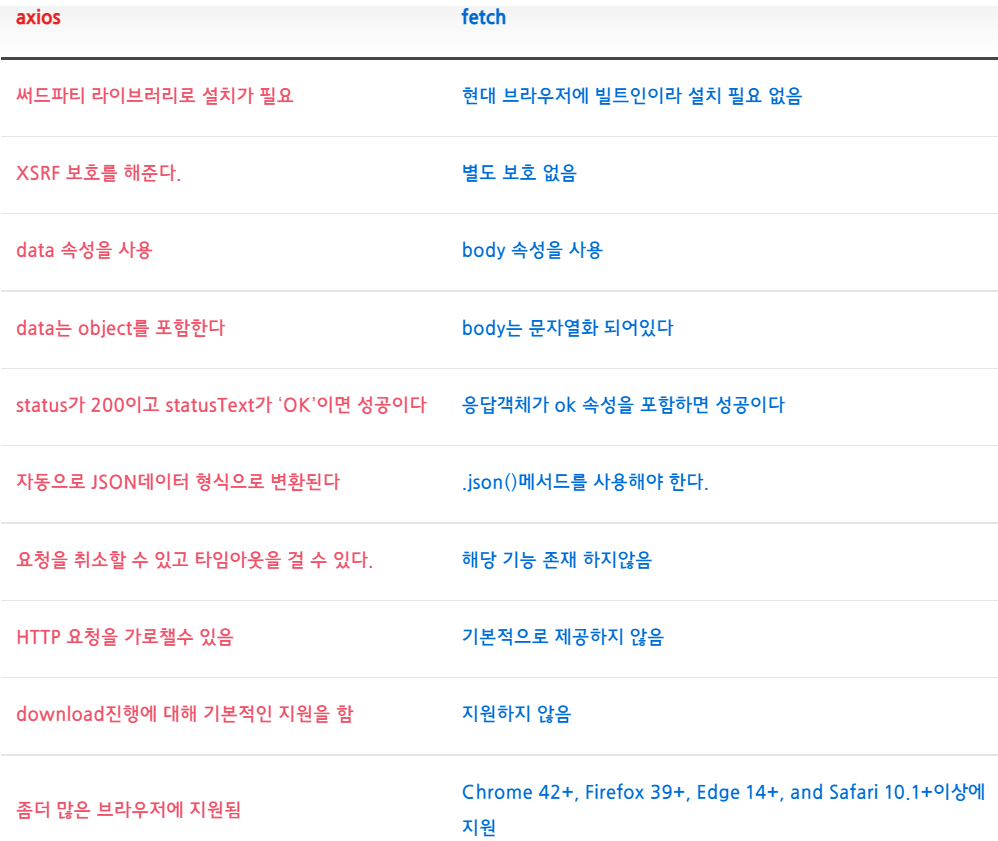

### 1. axios로 서버에 get요청

```

axios.get(//데이터 요청할 URL)
.then((result)=>{
  console.log(result.data);
) //성공했을 때 실행할 코드
.catch() //실패했을 때 실행할 코드
//새로고침 없이 데이터 가져온다

```

### 2. 

```

<button onClcik={()=>{

axios.get()

}

```

### 3.

```

//유사하게
fetch(URL).then().catch()
///axios는 JSON을 가져와서 Object로 바꿔줌 fetch는 JSON을 그대로 가져옴

```

### 4.

```

//shoes에 axios로 받은 것들 추가
axios.get(URL).then((result)=>{
  setItems([...Items, ...result.data]);
}

```

### 5.

```

axios.post(서버URL,{전달할 데이터의 객체});

```

### 6. sidebar

reactbootstrap-> 검색창에 nav -> tab

### 7.

```
onclick={()=>{setClickedTab(1)}};

const[clickedTab,setClickedTab]=useState();

<TabContent clickedTab={clickedTab}/>

function TabContent=(props)=>{
  if(props.clickedTab===1){
    return <div> </div>
   }
  else if(props.clickedTab===2){
    return <div> </div>
    }
    
 ```
    
### 8. css transition

프로퍼티 값의 변화가 일정시간에 걸쳐 일어나도록 한다

```

transition: all 2s;

transition-property: width, background-color;
transition-duration: 2s, 2s;

//ease	기본값. 느리게 시작하여 점점 빨라졌다가 느리지면서 종료한다.	
//linear	시작부터 종료까지 등속 운동을 한다.	
//ease-in	느리게 시작한 후 일정한 속도에 다다르면 그 상태로 등속 운동한다.	
//ease-out	일정한 속도의 등속으로 시작해서 점점 느려지면서 종료한다.	
//ease-in-out	ease와 비슷하게 느리게 시작하여 느리지면서 종료한다.

transition-timing-function: ease;

transition-delay: 1s;

transition: width 1s ease-in 1s;

```

### 9.

```

const animation = keyframes`
  0% {
    transform:rotate(0deg);
    border-radius:0px;
  }
  50% {
    border-radius:100px;
  }
  100%{
    transform:rotate(360deg);
    border-radius:0px;
  }
`;

const Box = styled.div`
  height: 200px;
  width: 200px;
  background-color: tomato;
  animation:${animation} 1s linear infinite; //1초동안 선형 무한 속성값주기
`;

```

### 10. axios

Axios 란?
Axios는 브라우저, Node.js를 위한 Promise API를 활용하는 HTTP 비동기 통신 라이브러리 아다.
쉽게 말해서 백엔드랑 프론트엔드랑 통신을 쉽게하기 위해 Ajax와 더불어 사용한다.
이미 자바스크립트에는 fetch api가 있지만, 프레임워크에서 ajax를 구현할땐 axios를 쓰는 편이라고 보면 된다.

Axios 특징
운영 환경에 따라 브라우저의 XMLHttpRequest 객체 또는 Node.js의 http api 사용
Promise(ES6) API 사용
요청과 응답 데이터의 변형
HTTP 요청 취소
HTTP 요청과 응답을 JSON 형태로 자동 변경



위와 같은 표를 보았을 때 axios는 별도의 설치가 필요하다는 단점이 있지만 그것을 커버할 만한 fetch 보다 많은 기능 지원과 문법이 조금이나마 간소화 된다는 장점이 있다는 것을 볼 수 있다.

따라서, 간단하게 사용할때는 fetch를 쓰고, 이외의 확장성을 염두해봤을 땐 axios를 쓰면 좋다고 보면 된다.

```

axios({
    method: "get", // 통신 방식
    url: "www.naver.com", // 서버
    headers: {'X-Requested-With': 'XMLHttpRequest'} // 요청 헤더 설정
    params: { api_key: "1234", langualge: "en" }, // ?파라미터를 전달
    responseType: 'json', // default
    
    maxContentLength: 2000, // http 응답 내용의 max 사이즈
    validateStatus: function (status) {
      return status >= 200 && status < 300; // default
    }, // HTTP응답 상태 코드에 대해 promise의 반환 값이 resolve 또는 reject 할지 지정
    proxy: {
      host: '127.0.0.1',
      port: 9000,
      auth: {
        username: 'mikeymike',
        password: 'rapunz3l'
      }
    }, // proxy서버의 hostname과 port를 정의
    maxRedirects: 5, // node.js에서 사용되는 리다이렉트 최대치를 지정
    httpsAgent: new https.Agent({ keepAlive: true }), // node.js에서 https를 요청을 할때 사용자 정의 agent를 정의
})
.then(function (response) {
    // response Action
});

```

axios 응답(response) 데이터
axios를 통해 요청을 서버에게 보내면, 서버에서 처리를하고 다시 데이터를 클라이언트에 응답 하게 된다.

이를 .then으로 함수인자로(response)로 받아 객체에 담진 데이터가 바로 응답 데이터이다.

ajax를 통해 서버로부터 받는 응답의 정보는 다음과 같다. 

```

	axios({
    method: "get", // 통신 방식
    url: "www.naver.com", // 서버
})
.then(function(response) {
  console.log(response.data)
  console.log(response.status)
  console.log(response.statusText)
  console.log(response.headers)
  console.log(response.config)
})
response.data: {}, // 서버가 제공한 응답(데이터)
 
response.status: 200, // `status`는 서버 응답의 HTTP 상태 코드
 
response.statusText: 'OK',  // `statusText`는 서버 응답으로 부터의 HTTP 상태 메시지
 
response.headers: {},  // `headers` 서버가 응답 한 헤더는 모든 헤더 이름이 소문자로 제공
 
response.config: {}, // `config`는 요청에 대해 `axios`에 설정된 구성(config)
 
response.request: {}
// `request`는 응답을 생성한 요청

```

Axios 단축 메소드
axios를 편리하게 사용하기 위해 모든 요청 메소드는 aliases가 제공된다.

위 처럼 객체 옵션을 이것저것 주면 가독성이 떨어지고 너저분하니, 함수형으로 재구성하여 나눠논 것으로 이해하면 된다.

axios의 Request method에는 대표적으로 다음과 같은 것들이 있다.

GET : axios.get(url[, config])
POST : axios.post(url, data[, config])
PUT : axios.put(url, data[, config])
DELETE : axios.delete(url[, config])

```

// user에게 할당된 id 값과 함께 요청을 합니다.
axios.get('/user?ID=12345')
  .then(function (response) {
    // 성공했을 때
    console.log(response);
  })
  .catch(function (error) {
    // 에러가 났을 때
    console.log(error);
  })
  .finally(function () {
    // 항상 실행되는 함수
  });
 
 
// 위와는 같지만, 옵션을 주고자 할 때는 이렇게 요청을 합니다.
axios.get('/user', {
    params: {
      ID: 12345
    }
  })
  .then(function (response) {
    console.log(response);
  })
  .catch(function (error) {
    console.log(error);
  })
  .finally(function () {
    // always executed
  });  
 
 
// async/await 를 쓰고 싶다면 async 함수/메소드를 만듭니다. 
async function getUser() {
  try {
    const response = await axios.get('/user?ID=12345');
    console.log(response);
  } catch (error) {
    console.error(error);
  }
}

```

```

axios.post("url", {
		firstName: 'Fred',
		lastName: 'Flintstone'
    })
    .then(function (response) {
        // response  
    }).catch(function (error) {
        // 오류발생시 실행
    })
    
```

axios.delete('/user?ID=12345')
  .then(function (response) {
    // handle success
    console.log(response);
  })
  .catch(function (error) {
    // handle error
    console.log(error);
  })
  
```

	axios.delete('/user?ID=12345',{
    data: {
      post_id: 1,
      comment_id: 13,
      username: "foo"
    }
  })
  .then(function (response) {
    // handle success
    console.log(response);
  })
  .catch(function (error) {
    // handle error
    console.log(error);
  })
  
```

```

REST 기반 API 프로그램에서 데이터베이스에 저장되어 있는 내용을 갱신(수정)하는 목적으로 사용된다..

PUT메서드는 서버에 있는 데이터베이스의 내용을 변경하는 것을 주 목적으로 하고 있다.

put 메서드는 서버 내부적으로 get -> post 과정을 거치기 때문에 post 메서드와 비슷한 형태이다.

axios.put("url", {
        username: "",
        password: ""
    })
    .then(function (response) {
         // response  
    }).catch(function (error) {
        // 오류발생시 실행
    })
    
```

