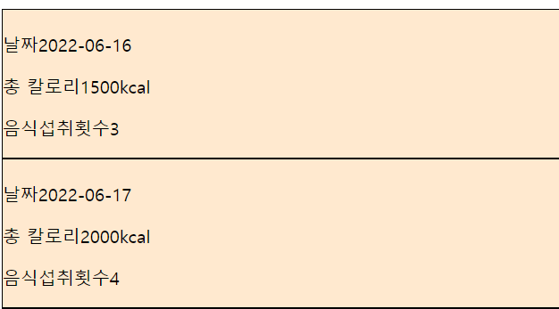

### 1.background vs backgound-color 차이

backgroud와 background-color 모두 색상을 지정할 수 있다. 다만 background-color 즉 색깔만 지정할 수 있는 반면에, background는 color 이외의 다른 background 옵션들을 지정해 사용할 수 있다.

### 2.background color지정할때 ffe9cf라고 하면 안되고 #ffe9cf라고 해야한다

### 3.justify-content는 display:flex의 하위 컴포넌트에 지정해야 하나 아니면 같은 컴포넌트에 지정해야 하는지

### 4.
```
const Icon = styled.div`
    display: flex;
    justify-content: flex-end;
    align-items: flex-end;
  `;
  
  ```
  에서 오른쪽 끝으로는 보내지는데 아래쪽 끝으로는 안보내지는 이유
  
  
### 5.icon크기 조절

```
 <Icon>
        <ControlPointIcon width="50px" height="50px" />
      </Icon>
```
여기서 icon크기 조절 방법 어떻게 하는지

### 6.github이미지파일 제목 수정

### 7.



여기서 한 줄에 두개의 props가 있도록 하고 세개부터는 아랫줄로 보내려면

### 8.

![이미지](
