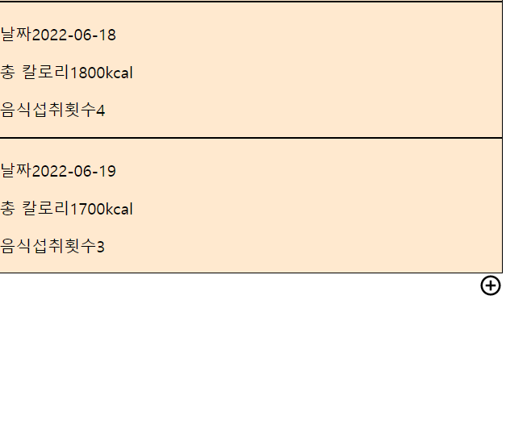
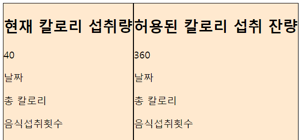
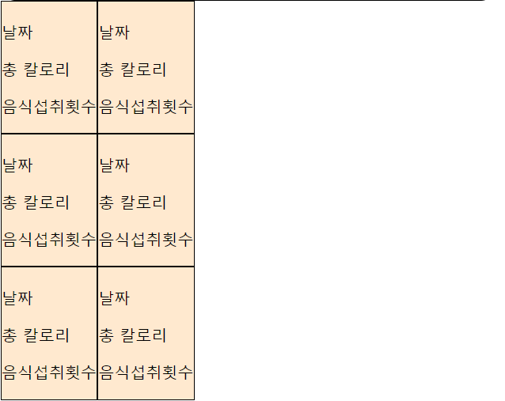
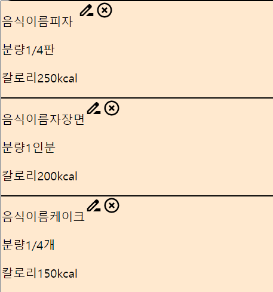

### 1.background vs backgound-color 차이

backgroud와 background-color 모두 색상을 지정할 수 있다. 다만 background-color 즉 색깔만 지정할 수 있는 반면에, background는 color 이외의 다른 background 옵션들을 지정해 사용할 수 있다.

### 2.background color지정할때 ffe9cf라고 하면 안되고 #ffe9cf라고 해야한다

### 3.justify-content는 display:flex의 하위 컴포넌트에 지정해야 하나 아니면 같은 컴포넌트에 지정해야 하는지

### 4.




```
const Icon = styled.div`
    display: flex;
    justify-content: flex-end;
    align-items: flex-end;
  `;
  
  ```
  에서 오른쪽 끝으로는 보내지는데 아래쪽 끝으로는 안보내지는 이유
  
  
### 5.icon크기 조절

```
 <Icon>
        <ControlPointIcon width="50px" height="50px" />
      </Icon>
```
여기서 icon크기 조절 방법 어떻게 하는지

### 6.github이미지파일 제목 수정

### 7.


```

export default function () {
  const Wrapper = styled.div`
    border: 1px solid black;
    background: #ffe9cf;
  `;
  
  return (
    <div>
      <Wrapper>
        <Box date="2022-06-16" totalCalories="1500kcal" numberOfIntakes="3" />
      </Wrapper>
      <Wrapper>
        <Box date="2022-06-17" totalCalories="2000kcal" numberOfIntakes="4" />
      </Wrapper>
      <Wrapper>
        <Box date="2022-06-18" totalCalories="1800kcal" numberOfIntakes="4" />
      </Wrapper>
      
  ```
  
여기서 한 줄에 두개의 props가 있도록 하고 세개부터는 아랫줄로 보내려면

### 8.



```

const Box = (props) => {
  return (
    <div>
      <h1>{props.description}</h1>
      <p>{props.calories}</p>
      <p>날짜{props.date}</p>
      <p>총 칼로리{props.totalCalories}</p>
      <p>음식섭취횟수{props.numberOfIntakes}</p>
    </div>
  );
  
  
  ```
  
  
```

<div style={{ display: "flex" }}>
        <Wrapper>
          <Box description="현재 칼로리 섭취량" calories="40" />
        </Wrapper>
        <Wrapper>
          <Box description="허용된 칼로리 섭취 잔량" calories="360" />
        </Wrapper>
      </div>
      
```


여기서 Box컴포넌트를 재활용하면서도
총칼로리 음식섭취횟수 등의 항목은 표시되지 않게 하려면

### 9.



```
const Section = styled.div`
  border: 1px solid black;
  background: #ffe9cf;
`;

const DisplayFlex = styled.div`
  display: flex;
`;
export default function () {
  return (
    <div>
      <Wrapper>
        <SearchBar />
      </Wrapper>
      <DisplayFlex>
        <Section>
          <Box foodName="" calories="" />
        </Section>
        <Section>
          <Box foodName="" calories="" />
        </Section>
      </DisplayFlex>
      <DisplayFlex>
        <Section>
          <Box foodName="" calories="" />
        </Section>
        <Section>
          <Box foodName="" calories="" />
        </Section>
      </DisplayFlex>
      <DisplayFlex>
        <Section>
          <Box foodName="" calories="" />
        </Section>
        <Section>
          <Box foodName="" calories="" />
        </Section>
      </DisplayFlex>
    </div>
    
```
    
    
BOX컴포넌트가 화면을 오른쪽 끝까지 

### 10.
AddCalories페이지 수정하면 흰화면으로 바뀌고 홈화면으로 들어갔다가 다시 이동해야 수정사항이 반영된다
GET http://localhost:3000/my-calories/bundle.js net::ERR_ABORTED 404 (Not Found)

### 11.


```

const Wrapper = styled.div`
    display: flex;
    justify-content: space-around;
    align-items: center;
  `;
  return (
    <div style={{ display: "flex" }}>
      <div>
        <p> 음식이름{props.foodName}</p>
        <p> 분량{props.amount}</p>
        <p> 칼로리{props.calories}</p>
      </div>
      <div>
        <Wrapper>
          <DriveFileRenameOutlineIcon />
          <HighlightOffIcon />
        </Wrapper>
      </div>
    
```
    
    ---><Wrapper>를 적용시켰는데도 아이콘이 정렬되지 않는이유
