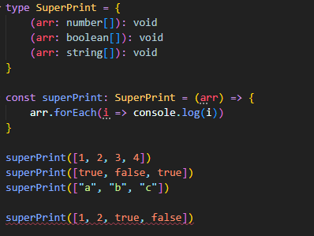
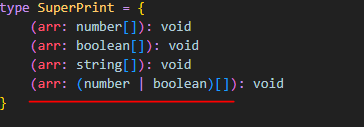
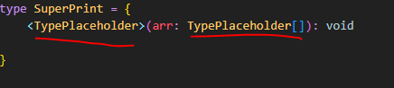
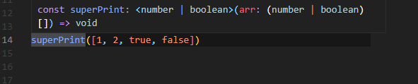
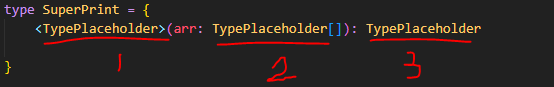
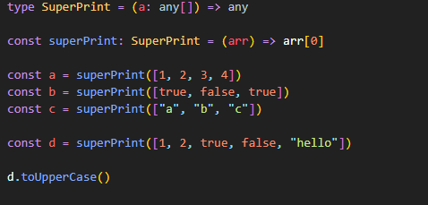
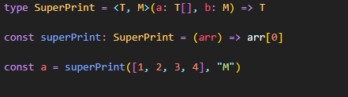

다형성:

```


type SuperPrint = {
    (arr:number[]):void
    (arr:boolean[]):void
}

const superPrint: SuperPrint=(arr)=>{
  arr.forEach(i=>console.log(i))
}

superPrint([1,2,3,4])
superPrint([true,false,true])

```

generic:타입의 placeholder같은것

```

type SuperPrint = {
    <T>(arr:T[]):void
 }
 
 //타입스크립트가 발견한 타입으로 바꿔준다
 
 ```

### 다형성 Polymorphism 이란?

'여러 모양'을 의미하는 그리스 단어이고 다형성에서 형은 타입(type)을 의미한다.

프로그래밍 언어에서 다형성이란, 여러 타입을 받아들임으로써 여러 형태를 가지는 것을 의미한다.

### generic이란?
- 타입의 placeholder같은것이다. *concrete type대신 쓸 수 있다.

(*concrete type이란? : number, boolean, string, unknown, void 등 을 일컬음)

- 타입스크립트로 placeholder를 작성할 수 있고 그게 뭔지 추론해서 함수를 사용하는것.

- call signature를 작성할때 들어갈 확실한 타입을 모를 때 제네릭을 사용한다.

- 보통은 다른 라이브러리 또는 패키지를 사용하기때문에 직접 제네릭을 작성할 일은 드물다
 
 배열의 call signature가 여러개 있다면?

-> 이럴땐 제네릭을 사용해서 간략하게 표기할 수 있다.

```

//제네릭 사용전 (3개의 콜시그니쳐가 쓰인것을 볼수 있다.)
type SuperPrint  = {
   (arr: number[]):void
   (arr: boolean[]):void
   (arr: string[]):void
 }
//제네릭 사용 후 (더욱 간단하게 코드작성을 할 수 있다.)
type SuperPrint  = {
 <T> (a: T[]) => void //앞에 꺽쇠<>를 열고 안에 제네릭 이름을 써준다.
}

```

```

type SuperPrint = <T, M> (a: T[], b:M) => T // 여러개의 제네릭을 만들 수 있음.

const superPrint:SuperPrint = (a) => a[0]

const a = superPrint([1, 2, 3],'hello')  // -> 제네릭을 사용하면 타입을 유추하고 마우스를 올리면 number로 유추한 타입으로 콜시그니처를 보여주는것을 알수 있다.
const b = superPrint([true, false],0) //마찬가지로 string타입으로 유추해서 보여줌
const c = superPrint(['one', 'two'],0)
const d = superPrint(['one', 1 , true],0)

// any를 쓰지 않는이유: 
d.toUpperCase() // (string에서만 쓸 수 있는 함수.)
// any를 사용하면 위 함수의 오류를 찾지 못한다. (타입스크립트의 보호를 받지 못함.)

```

다형성: 다른모양의 코드를 가질수 있게 해준다.
다형성을 이루 수 있는 방법은 제네릭을 사용하는 것이다. 제네릭은 placehoder타입을 쓸 수 있도록 해준다.


### 다형성

도대체 polymorphism이 뭘까?  

기본적으로 함수는 다른 형태와 모양을 가지고 있다.  타입스크립트에서 함수가 다른 2~3개의 파라미터를 가질 수 있는 것 처럼 말이다. 이런것을 다형성이라고 한다. 

### concrete Type과 generic
우리가 이전부터 봐왔던 number,string,void 같은 타입이다. 

 

근데 여기서부터 우리는 타입스크립트 한테 generic 타입을 받을 것이라고 알려줄 것인데 , generic은 타입의 placeholder같은 것이다.  concrete type을 쓰는 대신 쓸 수 있다. 



네번째 superPrint는 Call Signature을 설정해주지 않았기 때문에 에러가 뜬다. 

 

방법은 두가지가 있다.

1. or을 통해서 경우의 수를 생각한다.



하지만 이건  배열의 데이터 타입을 일일이 다 생각해줘야 하는 문제점이 있다. 

 

2. generic

이런 문제점을 해결해주는 것이 generic이다. 

generic은 타입의 place holder같은 존재이다. 그리고 타입스크립트는 그 타입을 유추한다.

 

정리해서 말하자면 call signature에 들어갈 데이터 타입(concrete type)을 정확히 모를때 generic을 사용한다. 



위와 같은 형식이  타입스크립트가 call signature에게 제네릭을 받는다고 알려주는 방법이다.

<> 이런 꺽쇠표시를 제네릭이라고 한다. 자바에서 제네릭 프로그래밍 할때와 비슷하다.

 

자 그러면 superPrint 배열을 다시 봐보자.



이렇게 number와 boolean이 같이 섞인 경우도 generic을 써주면 타입스크립트가 자동으로 number | boolean으로 인식한다. 

 

제네릭을 사용하면 배열에 다양한 타입이 들어갈 수 있다!

 

이제 배열의 0번째 값을 출력해볼 것이다.

우선 SuperPrint type alias를 수정해봤다.



1번은 generic이라고 선언한 것이고, 2번은 제네릭을 통해 데이터타입에 해당되는 배열을 매개변수로 설정한다. 3번은 제네릭을 통한 데이터타입에 해당되는 애들 리턴한다. 

근데 여기서 궁금증이 생긴다. <T>에 해당하는 부분에 any를 쓰면 안될까? 아무거나 넣어도 아무거나 리턴이 되니까 말이다! 하지만 이러면 보호장치를 완전히 상실해 버린다.
    



d의 0번째 인덱스가 숫자 1인데 이걸 UpperCase로 바꿀 수 없다. 

하지만 any를 썼기 때문에 에러 메세지를 안 띄워주는 것이다. 

 

결론적으로 제네릭은 내가 요구하는대로 signature를 생성하는 도구라고 생각하면 된다.   
    
### 제네릭을 두개 사용해보자.
    

    
 첫번째 매개변수에는 배열이 오고 두번째 매개변수에는 그냥 변수가 온다고 설정해준다.

그리고 타입스크립트가 분석을 해서 숫자 배열과 문자열이 오는구나! 라고 결정을 내린다. 

 

제네릭이 두개일 때도 우리의 요청에 따라 생성해준다. 
