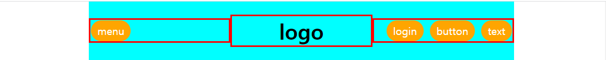
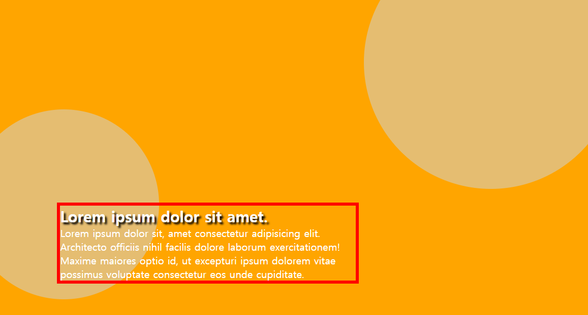
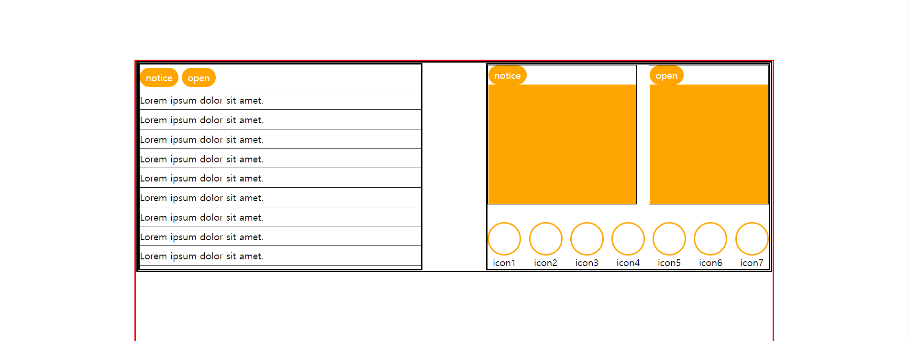
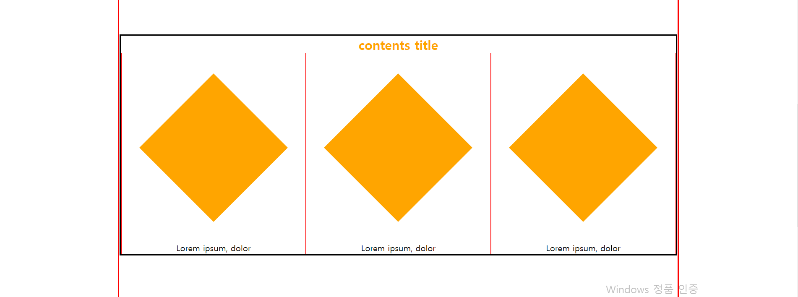
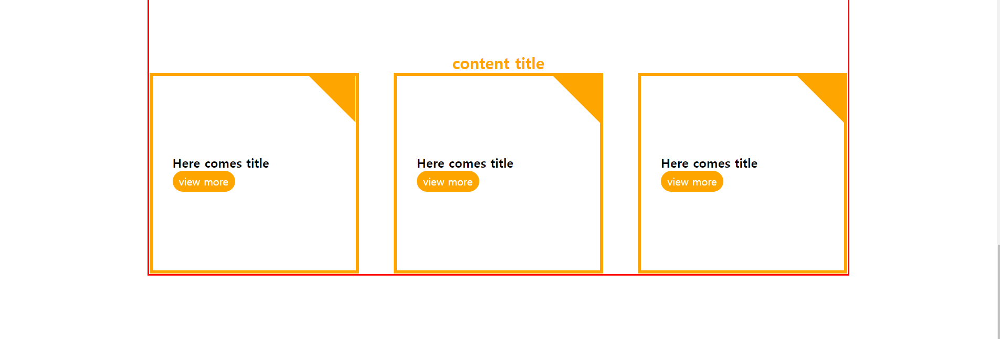
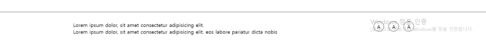

### 1.




```

 <div class="header flex">
      <div>
        <a href="#" class="btn">menu</a>
      </div>
      <h1>logo</h1>
      <div class="btnWrap flex">
        <a href="#" class="btn">login</a>
        <a href="#" class="btn">button</a>
        <a href="#" class="btn">text</a>
      </div>
    </div>
    
 .header {
    background: aqua;
    width: 70%;
    align-items: center;
    margin: 0 auto;
    justify-content: space-between;
    position: relative;
    padding: 20px 0;
    //어차피 공간에 꽉차서 간격이 없는데 justify-content: space-between이유;
    //position:relative이유
}


.header>* {
    border: 3px solid red;
    flex: 1;
}

.header h1 {
    text-align: center;
}

.header .btnWrap {
    justify-content: flex-end;
    gap: 0 10px;
}


```



```

<div class="visual">
      <div class="circle1"></div>
      <div class="circle2"></div>
      <div class="txtWrap">
        <h2>Lorem ipsum dolor sit amet.</h2>
        <p>
          Lorem ipsum dolor sit, amet consectetur adipisicing elit. Architecto
          officiis nihil facilis dolore laborum exercitationem! Maxime maiores
          optio id, ut excepturi ipsum dolorem vitae possimus voluptate
          consectetur eos unde cupiditate.
        </p>
      </div>
    </div>
    
.visual {
    height: 500px;
    background: orange;
    position: relative;
    overflow: hidden;
}


.visual .circle1 {
    width: 400px;
    height: 400px;
    border-radius: 50%;
    background-color: #e5bd71;
    position: absolute;
    top: -20%;
    right: -5%;
}
//그냥 .circle1이라고 안하고
//.visual .circle이라고 한 이유
//주석처리가 안되는 이유
//top:-20%라고 할때 무엇을 기준으로 %를 정하는지

.visual .circle2 {
    width: 300px;
    height: 300px;
    background: #e5bd71;
    border-radius: 50%;
    position: absolute;
    left: -5%;
    bottom: 5%;
}

.visual .txtWrap {
    position: absolute;
    bottom: 10%;
    left: 10%;
    border: 5px solid red;
    width: 50%;
    color: #fff;
}


.visual .txtWrap h2 {
    text-shadow: 3px 3px 3px #000;
}

```



```

<div class="content">
      <div class="con1 flex">
        <div class="con1-left">
          <div>
            <a class="btn" href="">notice</a>
            <a class="btn" href="">open</a>
          </div>
          <ul>
            <li>Lorem ipsum dolor sit amet.</li>
            <li>Lorem ipsum dolor sit amet.</li>
            <li>Lorem ipsum dolor sit amet.</li>
            <li>Lorem ipsum dolor sit amet.</li>
            <li>Lorem ipsum dolor sit amet.</li>
            <li>Lorem ipsum dolor sit amet.</li>
            <li>Lorem ipsum dolor sit amet.</li>
            <li>Lorem ipsum dolor sit amet.</li>
            <li>Lorem ipsum dolor sit amet.</li>
          </ul>
        </div>
        <div class="con1-right">
          <div class="right-top flex">
            <div class="notice">
              <a href="#" class="btn">notice</a>
              <div class="orange"></div>
            </div>
            <div class="open">
              <a href="#" class="btn">open</a>
              <div class="orange"></div>
            </div>
          </div>
          <div class="right-bottom flex">
            <div>
              <div class="circle"></div>
              <p>icon1</p>
            </div>
            <div>
              <div class="circle"></div>
              <p>icon2</p>
            </div>
            <div>
              <div class="circle"></div>
              <p>icon3</p>
            </div>
            <div>
              <div class="circle"></div>
              <p>icon4</p>
            </div>
            <div>
              <div class="circle"></div>
              <p>icon5</p>
            </div>
            <div>
              <div class="circle"></div>
              <p>icon6</p>
            </div>
            <div>
              <div class="circle"></div>
              <p>icon7</p>
            </div>
          </div>
        </div>
      </div>
      
.content {
    width: 70%;
    margin: 100px auto;
    border: 3px solid red;
}

.content>div:not(:last-child) {
    margin: 0 0 150px;
    border: 3px solid #000;
}
//이 부분 이유

.con-title {
    color: orange;
    text-align: center;
}


.content>.con1 {
    justify-content: space-between;
}

.con1>div {
    width: 45%;
    border: 3px solid #000;
    box-sizing: border-box;
}

.con1-left div, .con1-left li {
    border-bottom: 1px solid black;
    gap: 5px 0;
    box-sizing: border-box;
    padding: 5px 0;
}
.con1 .right-top {
    gap: 0 20px;
    margin: 0 0 30px;
}
//여기서 margin-bottom이라고 하지않고
//margin: 0 0 30px라고 한 이유
.con1 .orange {
    height: 200px;
    background: orange;
}

.con1 .right-top>div {
    border: 1px solid #000;
    box-sizing: border-box;
}

.con1 .right-top>.notice {
    flex: 5
}

.con1 .right-top>.open {
    flex: 4;
}

.con1 .circle {
    width: 50px;
    height: 50px;
    border-radius: 50%;
    border: 3px solid orange;
}

.con1 .right-bottom {
    justify-content: space-between;
    text-align: center;
}
//어차피 꽉 차있어서 간격이 없는데
//justify-content:space-between추가한 이유

```



```

      <div class="con2">
        <h2 class="con-title">contents title</h2>
        <div class="flex">
          <div>
            <div class="dia"></div>
            <p>Lorem ipsum, dolor</p>
          </div>
          <div>
            <div class="dia"></div>
            <p>Lorem ipsum, dolor</p>
          </div>
          <div>
            <div class="dia"></div>
            <p>Lorem ipsum, dolor</p>
          </div>
        </div>
      </div>
      
 .con2 .flex>div {
    border: 1px solid red;
    flex: 1;
    text-align: center;
}
.con2 .dia {
    width: 200px;
    height: 200px;
    background: orange;
    margin: 80px auto;
    //이 부분 이유
    transform: rotate(45deg);
}

```



```

      <div class="con3">
        <h2 class="con-title">content title</h2>
        <div class="flex">
          <div>
            <h3>Here comes title</h3>
            <a href="#" class="btn">view more</a>
          </div>
          <div>
            <h3>Here comes title</h3>
            <a href="#" class="btn">view more</a>
          </div>
          <div>
            <h3>Here comes title</h3>
            <a href="#" class="btn">view more</a>
          </div>
        </div>
      </div>
    </div>
    
.con3 .flex {
    justify-content: space-between;
}

.con3 .flex>div {
    width: 30%;
    border:5px solid orange;
    padding: 120px 30px;
    box-sizing: border-box;
    position: relative;
    overflow: hidden;
}

.con3 .flex>div::after {
    content: "";
    display: block;
    width: 100px;
    height: 100px;
    background: orange;
    position: absolute;
    top: -50px;
    right: -50px;
    transform: rotate(45deg);
}

```



```

    <div class="footer">
      <div class="inner">
        <p>Lorem ipsum dolor, sit amet consectetur adipisicing elit.</p>
        <p>
          Lorem ipsum dolor, sit amet consectetur adipisicing elit. eos labore
          pariatur dicta nobis
        </p>
        <ul class="flex">
          <li>A</li>
          <li>A</li>
          <li>A</li>
        </ul>
      </div>
    </div>
    
.footer {
    border-top: 1px solid black;
    padding:30px 0;
}

.footer .inner {
    width: 70%;
    margin: 0 auto;
    /* background: aqua; */
    position: relative;
}

.inner ul {
    position: absolute;
    top: 0;
    right: 0;
    gap: 0 15px;
}

.inner ul li {
    border: 1px solid #000;
    border-radius: 50%;
    width: 30px;
    height: 30px;
    text-align: center;
    line-height: 30px;
}

```
