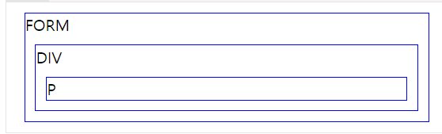

### 1.emotion을 사용할때 컴포넌트명을 sementic하게 지어야 한다 
예시 <Wrapper></Wrapper>

### 2.emotion 문법 예시
```
const Wrapper = styled.div`
  display: flex;
  flex-direction: column;
  text-align: right;
`;

```

### 3.&>svg가 무엇인지

### 4.box-sizing:border-box 가 무엇인지

### 5.emotion 컴포넌트 작성할때 가장 바깥에서 감싸고 하는것부터 위에 오게 적는다
```
const wrapper=styled.div
const icon=styled.div

<Wrapper>
<Icon>
<FontAwesomeIcon>
</Icon>
</Wrapper>

```

### 6.
```
const SideBar = () => {
  const [isActive, setIsActive] = useState(false);

  const onClickIcon = () => {
    setIsActive(!isActive);
  };
  ```
  
### 7.
```
<Icon onClick={onClickIcon}>
        {isActive ? <ArrowBackIosIcon /> : <DehazeIcon />}
      </Icon>
```
### 8.
```

{isActive && (
        <Section>
          <Nav>
            <Link to="/">GoToHomePage</Link>

//isActive가 true일때 표시되도록하는 코드

```
### 9.
```
 background: #fcfacb;
```
figma에서 그림 클릭했을때 우측에 표시되는 컬로코드를 그대로 사용할 수 있다

### 10.
```
position:absolute

```
부모 엘리먼트 내부에 속박되지 않고, 독립된 배치 문맥(positioning context)을 가지게 됩니다. 마치 포토샵 같은 그래픽 툴에서 새로운 레이어를 추가하는 효과에 비슷하다고 생각하시면 됩니다.

따라서, 엘리먼트를 기본적으로 브라우저 화면(viewport) 상에서 어디든지 원하는 위치에 자유롭게 배치시킬 수 있으며, 심지어 부모 엘리먼트 위에 겹쳐서 배치할 수도 있습니다.

단, 상위 엘리먼트 중에 position 속성이 relative인 엘리먼트가 있다면, 그 중 가장 가까운 엘리먼트의 내부에서만 엘리먼트를 자유롭게 배치할 수 있습니다. 즉, 전체 화면이 아닌 해당 상위 엘리먼트를 기준으로 offset 속성(top, left, bottom, right)이 적용됩니다.


상위 엘리먼트에 relative적용 안하면 가장 상위 엘리먼트인 body를 기준으로 적용한다

### 11.
```
z-index:2
```
겹쳐져있는것 무엇이 위로갈지 순서 정하는것

### 12.
```
  display: flex;
  flex-direction: column;
  text-align: right;
```

### 13.
조금씩 주석처리 하면서 에러 좁히기

### 14.emotion VS styled-component
mui가 emotion을 사용해서 emotion사용하는게 낫다

### 15.
커밋 조금씩 쪼개서 하기
수정하고 에러안날때마다 커밋하기

### 16.
react에서는 class라고 안하고 className이라고 한다

### 17.
git commit --amend
커밋메시지 변경

### 18.
dependency에 있는것 하나도 빠짐없이 왜 설치했는지 설명할 수 있어야 한다
프로젝트에 있는 모든 코드는 설명할 수 있어야 한다

### 19.CSS Selector
자손 결합자
  (공백) 결합자는 첫 번째 요소의 자손인 노드를 선택합니다.
구문: A B
예제: div span은 <div> 요소 안에 위치하는 모든 <span> 요소와 일치합니다.
자식 결합자
> 결합자는 첫 번째 요소의 바로 아래 자식인 노드를 선택합니다.
구문: A > B
예제: ul > li는 <ul> 요소 바로 아래에 위치하는 모든 <li> 요소와 일치합니다.
  
### 20.
node_modules삭제하고 dependency수정한다음 npm i

### 21.margin:auto
auto 값은 브라우저가 남은너비 의 공간을 계산하여 좌우 균등하게 배분해 준다.
left & right의 value를 auto로 설정했다면,
element는 지정된 width 만큼 공간을 차지하며, 남은 공간은 균등하게 나뉘어 좌,우 margin이 갖게 된다.
- 참조: www.w3schools.com/css/css_margin.asp

그래서 auto를 적용하기 이전에 요소의 width가 정의 되어 있어야 한다.
### 22.
jsx에서 javascript코드 사용할때는 {}중괄호를 사용한다

### 23.이벤트버블링 예시 코드
```
<div onclick="alert('div에 할당한 핸들러!')">
  <em><code>EM</code>을 클릭했는데도 <code>DIV</code>에 할당한 핸들러가 동작합니다.</em>
</div>
```
버블링(bubbling)의 원리는 간단합니다.

한 요소에 이벤트가 발생하면, 이 요소에 할당된 핸들러가 동작하고, 이어서 부모 요소의 핸들러가 동작합니다. 가장 최상단의 조상 요소를 만날 때까지 이 과정이 반복되면서 요소 각각에 할당된 핸들러가 동작합니다.

3개의 요소가 FORM > DIV > P 형태로 중첩된 구조를 살펴봅시다. 요소 각각에 핸들러가 할당되어 있습니다.
  
```
  
<style>
  body * {
    margin: 10px;
    border: 1px solid blue;
  }
</style>

<form onclick="alert('form')">FORM
  <div onclick="alert('div')">DIV
    <p onclick="alert('p')">P</p>
  </div>
</form>
  
```
  

  
가장 안쪽의 <p>를 클릭하면 순서대로 다음과 같은 일이 벌어집니다.

p에 할당된 onclick 핸들러가 동작합니다.
  
바깥의 div에 할당된 핸들러가 동작합니다.
  
그 바깥의 form에 할당된 핸들러가 동작합니다.
  
document 객체를 만날 때까지, 각 요소에 할당된 onclick 핸들러가 동작합니다.
  
  이런 동작 방식 때문에 <p> 요소를 클릭하면 p → div → form 순서로 3개의 얼럿 창이 뜨는것이죠.

이런 흐름을 '이벤트 버블링’이라고 부릅니다. 이벤트가 제일 깊은 곳에 있는 요소에서 시작해 부모 요소를 거슬러 올라가며 발생하는 모양이 마치 물속 거품(bubble)과 닮았기 때문입니다.
  
  event.target
  
부모 요소의 핸들러는 이벤트가 정확히 어디서 발생했는지 등에 대한 자세한 정보를 얻을 수 있습니다.

이벤트가 발생한 가장 안쪽의 요소는 타깃(target) 요소라고 불리고, event.target을 사용해 접근할 수 있습니다.

event.target과 this(=event.currentTarget)는 다음과 같은 차이점이 있습니다.

event.target은 실제 이벤트가 시작된 ‘타깃’ 요소입니다. 버블링이 진행되어도 변하지 않습니다.
  
this는 ‘현재’ 요소로, 현재 실행 중인 핸들러가 할당된 요소를 참조합니다.
  
예시를 살펴봅시다.
  
  핸들러는 form.onclick 하나밖에 없지만 이 핸들러에서 폼 안의 모든 요소에서 발생하는 클릭 이벤트를 ‘잡아내고(catch)’ 있습니다. 클릭 이벤트가 어디서 발생했든 상관없이 <form> 요소까지 이벤트가 버블링 되어 핸들러를 실행시키기 때문입니다.

form.onclick 핸들러 내의 this와 event.target은 다음과 같습니다.

this(event.currentTarget) – <form> 요소에 있는 핸들러가 동작했기 때문에 <form> 요소를 가리킵니다.
event.target – 폼 안쪽에 실제 클릭한 요소를 가리킵니다.

### 24.package.json vs package-lock.json 차이
  
package.json에서는 버전정보를 저장할 때 version range를 사용합니다.
e.g.) "express": "~4.16.1"

version range란❓
🙋🏻‍♂️ : "내가 사용할 패키지의 버전은 4.16.1버전이야" 라고 말하는 대신
🙋🏻‍♂️ : "나는 4.16.1버전 이상, 그리고 4.17.0 미만의 패키지를 사용할거야" 라고 말하는 방식을 뜻해요.
물론 전자처럼 버전정보를 명시하는 것도 가능합니다.

협업을 하기위해 우리는 같은 package.json을 사용해서 각자의 컴퓨터에 같은 패키지들을 설치해서 같은 개발환경을 구성하게 됩니다.
  
  package-lock.json파일을 살펴보시면, package.json에는 틸드(~)로 명시되어있는 모듈들이 package-lock.json에는 버전명이 정확히 명시되어 있습니다.
  
  애초에 package.json에 정확한 버전명을 적어놓으면 안되는거야?

너무 맞는 말이죠. package.json에 정확한 버전명을 명시해두면, 패키지도 정확히 다운받아질텐데... 뭐가 문제지?

💭 TMI...
만약 package.json에 패키지 버전명을 정확히 명시하게 된다면, 프로젝트에서 사용하고 있는 패키지의 중요한 버그 수정이 이루어질 때 마다 프로젝트의 package.json에 적혀있는 버전도 수정을 해야하기 때문입니다.

모든 크고 작은 패키지들의 릴리즈에 대해 항상 추적하고 수정해야하는 엄청난 귀찮음과 수고스러움을 version range로 명시함으로써, 이를 해결해주는 것이었죠.
### 25. git convention chore
예시
react-router-dom설치
### 26. 모듈 import할때 ./ 와 @/차이
상대경로와 절대경로의 차이이다
  ```
  // before
import module from '../../../service/user';

// after
import module from '@service/user';
  ```
### 27.zsh
  Z 쉘이라고도하는 ZSH는 Bourne Shell (sh)의 확장 된 버전으로, 많은 새로운 기능과 플러그인 및 테마를 지원합니다. BSH와 동일한 셸을 기반으로하기 때문에 ZSH는 동일한 기능을 많이 가지고 있으며 전환이 매우 쉽습니다.


 
왜 그것을 사용 하는가?
ZSH에는 여기에 나열 할 기능이 너무 많으며 Bash가 약간 개선되었지만 다음과 같은 주요 기능이 있습니다.

자동 CD : 디렉토리 이름을 입력하십시오.
  
재귀 경로 확장 : 예를 들어 “/ u / lo / b”는 “/ usr / local / bin”으로 확장됩니다
  .
철자 교정 및 대략적인 완성 : 디렉토리 이름을 입력하는 데 약간의 실수가 있으면 ZSH가이를 수정합니다.
  
플러그인 및 테마 지원 : ZSH에는 다양한 플러그인 프레임 워크가 포함되어 있습니다
  
플러그인과 테마 지원은 아마도 ZSH의 가장 멋진 기능 일 것이며 여기서 초점을 맞출 것입니다.
  
  Oh-My-Zsh는 ZSH에 가장 널리 사용되는 플러그인 프레임 워크이며 많은 내장 플러그인과 테마도 제공됩니다. ZSH의 전체 패키지 관리자 인 Antigen을 포함한 몇 가지 다른 플러그인 프레임 워크도 있지만 Oh-My-Zsh에는 많은 플러그인이 내장되어 있으며 제대로 작동합니다.

zsh 강력한 온라인 커뮤니티를 활용하여 오 마이 Zsh. Oh My ZSH는 관리를위한 가장 오래되고 인기있는 옵션 중 하나입니다. 
  
  zsh 구성. 커뮤니티에서 제공하는 250 개 이상의 플러그인과 140 개의 서로 다른 테마를 제공하는 Oh My ZSH는 셸을 계속 업데이트하는 자동 업데이트 기능과 함께 제공되는 z 셸을 사용자 지정하기 시작하기에 좋은 곳입니다. 
  
  이를 통해 사용자는보다 개인화 된 인터페이스를 사용하여 쉘에서 작업하고 다양한 도구, 편리한 기본 지원 시스템에 액세스 할 수 있습니다. 예를 들어, 인터페이스에 매우 유리한 옵션은 오른쪽 프롬프트 또는 긴 파일 경로 또는 명령을 입력 할 때 자동으로 숨겨지는 사이드 프롬프트입니다.
  
  이 작은 수준의 유연성조차도 개발자의 머리를 zsh.
