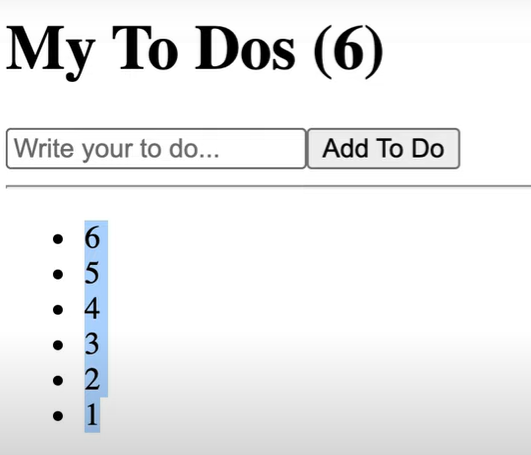

setNumber( preNum => preNum + 1)

 위와 같이 기존 값을 값을 업데이트 하는 함수를 넣어 값을 업데이트 할 수도 있다.

[](https://www.nextree.co.kr/p8428/)

```

import { useState } from "react";
function App() {
  const [toDo, setToDo] = useState("");
  const [toDos, setToDos] = useState([]);
  const onChange = (event) => setToDo(event.target.value);
  const onSubmit = (event) => {
    event.preventDefault();
    if (toDo === "") {
      return;
    }
    setToDos((currentArray) => [toDo, ...currentArray]);
    setToDo("");
  };
  //입력창에 있는것 toDos배열에 추가하고 입력창 초기화
  return (
    <div>
      <h1>My To Dos ({toDos.length})</h1>
      <form onSubmit={onSubmit}>
        <input
          onChange={onChange}
          value={toDo}
          type="text"
          placeholder="Write your to do..."
        />
        <button>Add To Do</button>
      </form>
      <hr />
      <ul>
        {toDos.map((item, index) => (
          <li key={index}>{item}</li>
        ))}
      </ul>
      //할일 목록 시각화
    </div>
  );
}

```
